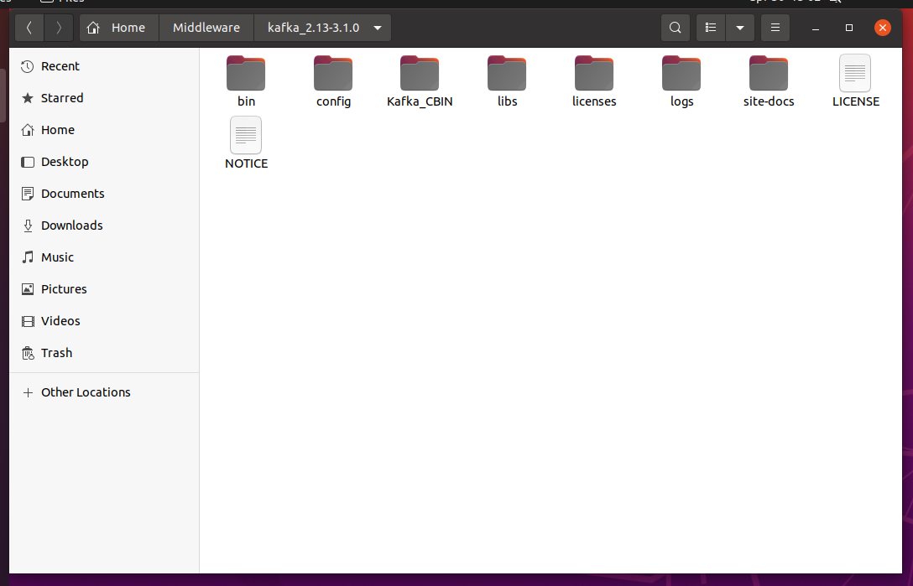
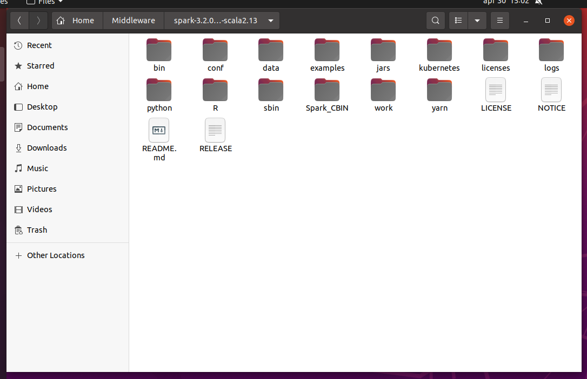

# Kafka

**NOTE: A working JVM (at least Java 11) is required to run the packages.**

The folder `Kafka_CBIN` contains the .jar file and some useful scripts to run the environment with the correct parameters. In order to work, it must be placed in the root folder of the Kafka installation (download [here](https://dlcdn.apache.org/kafka/3.1.0/kafka_2.13-3.1.0.tgz)).

<p align="center">
  
</p>

* `1-run_zookeeper.sh` is necessary for Kafka to work.
* `2-run_kafka.sh` initializes the Kafka environment.
* `3-create_topics.sh` initializes the topics used in the application.
* `4-submit_application.sh` submits the .jar file in the app folder to the Kafka engine. It is possible to run multiple instances of this .jar for scalability.

<br/>

* `D1-run_publisher.sh` is useful for debugging, allows manual publication of events on a specific topic.  
Usage `./D1-run_publisher.sh topic_name`
* `D2-run_subscriber.sh` is useful for debugging, reads the content of a Kafka topic.  
Usage `./D2-run_subscriber.sh topic_name`
* `D3-submit_demo.sh` is useful for debugging, creates random generated records.

<br/>

* `X2-clear_environment.sh` clears the system after the application is closed. Stop Kafka and Zookeeper before running this.

# Spark

**NOTE: A working JVM (at least Java 11) is required to run the packages.**

The folder `Spark_CBIN` contains the .jar file and some useful scripts to run the environment with the correct parameters. In order to work, it must be placed in the root folder of the Spark installation (download [here](https://dlcdn.apache.org/spark/spark-3.2.1/spark-3.2.1-bin-hadoop3.2-scala2.13.tgz)).

<p align="center">
  
</p>

* `5-start-local.sh` sets up a local Spark cluster with a master and a worker.
* `6-submit_cleaning_enrichment.sh` submits to the Spark cluster the back-end module for data cleaning and enrichment.
* `7-submit_analysis.sh` submits to the Spark cluster the back-end module for data analysis.

<br/>

* `X1-stop-local.sh` kill the Spark cluster. Stop the Spark streming application before running this.

## Send data

You can act like end-user applications opening a socket connection with the backend with the following command:

`nc localhost 9999`

Then send well-formed strings from the command line.  
(You can open multiple instances if neeeded)

# MPI

**NOTE: A working installation of MPI is required.**

## Usage

In the `MPI_simulator` directory, the module can be compiled with `make` (a Makefile is provided).

### Command line parameters

The simulation parameters are provided via command line.
**NOTE**: For now, the program accepts integer and float arguments, and arguments are required.

The program accepts the following command line options:


| Short options | Meaning                          | Type    | Example  |
|---------------|----------------------------------|---------|----------|
| `P`           | Number of people                 | `int`   | `-P 100` |
| `V`           | Number of vehicles               | `int`   | `-V 10`  |
| `W`           | Width of the region (in meters)  | `int`   | `-W 500` |
| `L`           | Length of the region (in meters) | `int`   | `-L 300` |
| `t`           | Time step (in seconds)           | `float` | `-t 1`   |


| Long options           | Meaning                                                      | Type       | Example                            |
|------------------------|--------------------------------------------------------------|------------|------------------------------------|
| `Np`                   | Noise produced by every person (in dB)                       | `float`    | `--Np 2`                           |
| `Nv`                   | Noise produced by every vehicle (in dB)                      | `float`    | `--Nv 10`                          |
| `Dp`                   | Radius of circular area affected by a person                 | `float`    | `--Dp 2`                           |
| `Dv`                   | Radius of circular area affected by a vehicle                | `float`    | `--Dv 10`                          |
| `Vp`                   | Speed of a person (in m/s)                                   | `float`    | `--Vp 1`                           |
| `Vv`                   | Speed of a vehicle (in m/s)                                  | `float`    | `--Vv 14`                          |
| `db`                   | Activate debug prints                                        |            | `--db`                             |
| `origin-latitude`      | Latitude coordinate (in decimal degrees) of the area origin  | `float`    | `--origin-latitude 45.890`         |
| `origin-longitude`     | Longitude coordinate (in decimal degrees) of the area origin | `float`    | `--origin-longitude 9.0804`        |
| `kafka-bridge-address` | IPv4 address of the Kafka producer (bridge)                  | `C string` | `--kafka-bridge-address 127.0.0.1` |
| `kafka-bridge-port`    | Network port of the Kafka producer (bridge)                  | `int`      | `--kafka-bridge-port 9999`         |

To print all the debug prints, the `db` option must be given first.

The default values for the the address of the Kafka producer is `127.0.0.1:9999`.

The following long option aliases are also supported:

| Long alias          | Short option |
|---------------------|--------------|
| `n-of-people`       | `P`          |
| `n-of-vehicles`     | `V`          |
| `width-of-region`   | `W`          |
| `length-of-region`  | `L`          |
| `noise-per-person`  | `Np`         |
| `moise-per-vehicle` | `Nv`         |
| `radius-of-person`  | `Dp`         |
| `radius-of-vehicle` | `Dv`         |
| `speed-of-person`   | `Vp`         |
| `speed-of-vehicle`  | `Vv`         |
| `debug`             | `db`         |

The "radius" of a person vehicle is intended as half the side of a square area. For instance, in the picture:

```text
          ---------
      ---/         \---
     /                 \
   -/                   \-
  /                       \
  |                       |
 /                   r     \
 |            P-------------|
 \                         /
  |                       |
  \                       /
   -\                   /-
     \                 /
      ---\         /---
          ---------
```

The `P` represents a person, and the radius is `r` (calculated as euclidean distance).

### Convenience scripts

Three scripts are provided to quickly run the program:
  * `quickrun.sh` executes the simulation "clean", multithreaded
  * `debug.sh` executes the simulation multithreaded, with the debug flag
  * `single-thread` executes the simulation as a normal program, single-threaded and with the debug flag

# Contiki-NG

**NOTE: Contiki-NG toolchain and Cooja simulator are required.**

In order to work, the folder `rpl-udp` must replace its homonym inside the `examples` folder of [this](https://bitbucket.org/neslabpolimi/contiki-ng-mw-2122.git) repository.