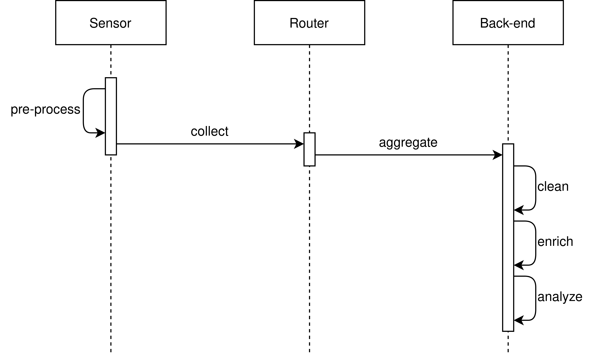

# Simulation and Analysis of Noise Level

<!--
This file shall be exported from Visual Studio Code using yzane.markdown-pdf extension.
The syntax to insert a page break in the printed file is 

-->

## Introduction

This project aims to design and implement a distributed system that studies the level of noise in a country. The country is divided into regions: some of them provide open access to noise data from sensors, while others do not. The system uses sensor data in regions where they are available, and data generated by a computer simulation otherwise.

## Architecture

To better exploit the potential of every technology involved, the distributed system is split into three main modules:

* A **data aggregation and processing module** (back-end), based on Apache Kafka and Apache Spark, with good processing capabilities to handle a huge amount of incoming data.

* A **data collection module**, based on Contiki-NG, whose purpose is to implement an edge-computing system able to pre-process and redirect the collected data to the back-end.

* A **simulation module**, based on MPI, whose purpose is to hide to the back-end module the lack of data when the use of sensors is not allowed.

&nbsp;

  

&nbsp;

The communication between modules is performed through the Internet.

The system is based on the assumption that communication between modules is never guaranteed since the majority of the devices are intrinsically very unstable (we are talking about IoT devices held by common users). As a consequence, the information records exchanged between the front-end and back-end should be kept as light as possible. For a detailed explanation of how every record is composed, see the section about **design choices**.

### Data aggregation and processing module (Kafka and Spark)

This module consists of a Spark cluster that analyzes the noise data read from a Kafka topic. This topic aggregates the data coming from end devices ingesting strings through TCP sockets. Once the Spark Streaming engine has processed the data the results are stored in another proper Kafka topic available to the Spark SQL engine to compute some metrics.

Roughly speaking, the map-reduce paradigm of Spark implements the following functionalities:

* **Map** &#8594; Data cleaning and enrinchment

* **Reduce** &#8594; Data analysis

### Data collection module (Contiki-NG)

The only purpose of this module is to collect noise data in an energy-efficient way, perform a very light pre-processing and send the data to the back-end module.

* The **IoT end devices**  
1\. Detect the noise data around the sensor.  
2\. Perform a light pre-processing checking the average of the last 6 measurements.  
3\. Send the data to the nearest border router.

* The **router**  
1\. Collects the data from the near IoT devices.  
2\. Forwards the data of the back-end.

### Simulation module (MPI)

The idea behind the simulation module is to hide the possible absence of data to the back-end module, which must focus on the processing of the received data without spending computational resources on something else.

This module must then produce and send data in the **exact** same format produced by the data collection module, getting it from a simulated environment instead of the real one.

## Design choices

### Spark for data processing

The back-end module is a Java application developed using Spark. Since there are no guarantees on the amount of incoming data, it was necessary to build a flexible system capable of handling two extreme cases:

* When a lot of data is incoming.  
Spark is a framework that offers very efficient map-reduce functions to perform optimized calculations on big quantities of data, it is used in the application to create statistics efficiently, even when the amount of incoming values becomes huge.

* When almost no data is received.  
Spark is good since it performs calculations only when there is something in input, not wasting computational performance in an almost "idle" situation.

### Kafka for data aggregation

Kafka is used as a "middleman" between Spark and the Internet to take care of handling data coming from the end-user application. It is suitable for this purpose since Kafka provides very good scalability if the number of routers grows in size. Moreover, Kafka is used also to persist the ingested data and the computed metrics, hence its storage capabilities are very well exploited.

### Contiki-NG for data collection

The sensors are implemented in C using Contiki-NG and simulated using Cooja, which can reproduce the wireless behavior of such devices, which is suitable for the IoT devices' interaction. Moreover, Contiki-NG can perform light pre-processing on the collected data with a small performance impact.

The output record of each sensor is structured as follows (depending on the outcome of the pre-processing):

&nbsp;

  

Unlike in our early analysis of the system, it is not necessary to keep the notion of "sensor" over time. The entities of this module are meaningful only until they build the record with the detection. We can then forget about them and accept another read as completely uncorrelated with the previous one. This implies a light implementation also for the "router" nodes, whose only purpose is to redirect the collected data to the back-end.

### MPI for simulation

The simulations are implemented in C using MPI, a specification for high-performance distributed computing scenarios, that has among its main use cases the simulation of population dynamics. The use of MPI allows splitting the workload. Moreover, since the simulation is completely decoupled from the back-end, it can be outsourced to specialized machines with hardware optimized for this type of calculation.

**Why not Akka?**

An alternative we discussed for the simulation was Akka, as we thought of representing each entity capable of producing noise (people, vehicles) as an actor, but as the simulation grows in size, Akka wouldn't be able to keep up with the growing need for computational power. Instead, we opted for MPI which is much faster and needs fewer resources to run (no need for the JVM).

## Main functionalities

Since the application is built to work at runtime with a continuous stream of incoming data, the following diagram will represent the path of each record produced by the sensors. The overall view of the application is given by multiple records that fulfill this path in parallel.

&nbsp;

  

### Step 1 (Pre-processing)

Sensors detect the noise value at a given frequency. For every new reading, the average of the last 6 is recomputed with two possible outcomes:
1. The average is under a given threshold &#8594; The average record `<coordinates, value>` is sent to the nearest router device.

2. The average is over the threshold &#8594; The last 6 records `<coordinates, value>` are sent to the nearest router device.

### Step 2 (Data collection)

The router device collects the reads of all the near IoT devices and periodically forwards them to the back-end through the regular Internet.

### Step 3 (Data aggregation)

Kafka takes care of aggregating the ingested data in a single topic that can be accessed by Spark in the next step.

### Step 4 (Data cleaning, enrichment and analysis)

The Spark Streaming engine reads the data from the Kafka topic. Some predefined operations are applied to the input data and results are made persistent. At every moment the back-end user can read the Kafka topic where the results are stored or perform some analysis on the data through the Spark SQL engine.

_In case the values come from a simulation, the first two steps are replaced with a single "simulation" step. As already stated, from the perspective of the back-end, this complexity is hidden._

## Conclusions

The intrinsic modularity of the systems allows deployment without bothering with the links between modules. Each module can be run separately from the others since the connection is kept as light as possible. More importantly, disaggregation allowed each module to be independently tested with corner cases and in a maximum-stress environment.

**Authors:** Simone Braga, Alessandro Bertulli, Marco Dottor