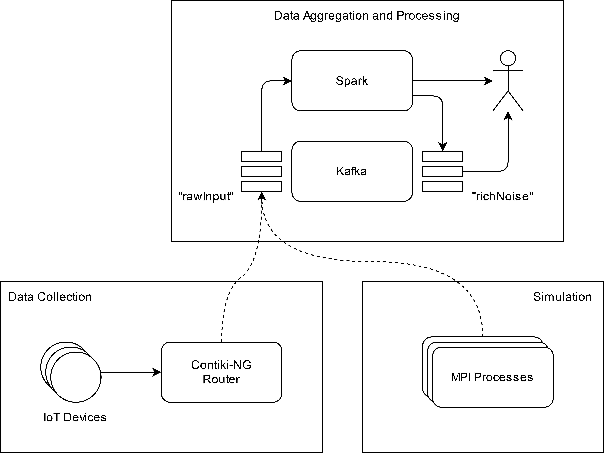

**4 PAGES DOCUMENTATION**

## Introduction

_Text goes here_

## Architecture

To better exploit the potential of every technology involved, the distributed system is split into three main modules:

* A **data processing module** (back-end), based on Apache Spark, with good processing capabilities to handle a huge amount of incoming data.

* A **data collection module**, based on Contiki-NG, whose purpose is to implement an edge-computing system able to pre-process and redirect the collected data to the back-end.

* A **simulation module**, based on MPI, whose purpose is to hide to the backend module the lack of data when the use of sensors is not allowed.

  

The communication between modules is performed through the Internet.

The system is based on the assumption that communication between modules is never guaranteed since the majority of the devices are intrinsically very unstable (we are talking about IoT devices held by common users). As a consequence, the information records exchanged between the front-end and back-end should be kept as light as possible. For a detailed explanation of how every record is composed, see the section about **design choices**.

### Data processing module (Spark)

This module consists of a Spark distributed cluster that analyzes the noise data received by other modules. The data is ingested from TCP sockets, then it's processed by the Spark engine that computes some metrics and stores the result.

### Data collection module (Contiki-NG)

The only purpose of this module is to collect noise data in an energy-efficient way, perform a very light pre-processing and send the data to the back-end module.

* The **IoT end devices**  
1\. Detect the noise data around the sensor.  
2\. Perform a light pre-processing checking the average of the last 6 measurements.  
3\. Send the data to the nearest border router.

* The **router**  
1\. Collects the data from the near IoT devices.  
2\. Forwards the data of the back-end.

### Simulation module (MPI)

The idea behind the simulation module is to hide the possible absence of data to the back-end module, which must focus on the processing of the received data without spending computational resources on something else.

The module must then produce and send data in the **exact** same format produced by the data collection module, getting it from a simulated environment instead of the real one.

## Design choices

_Text goes here_

## Main functionalities

_Text goes here_

## Conclusions

_Text goes here_
