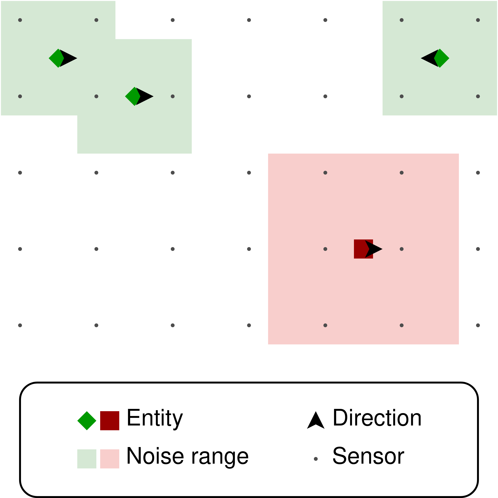
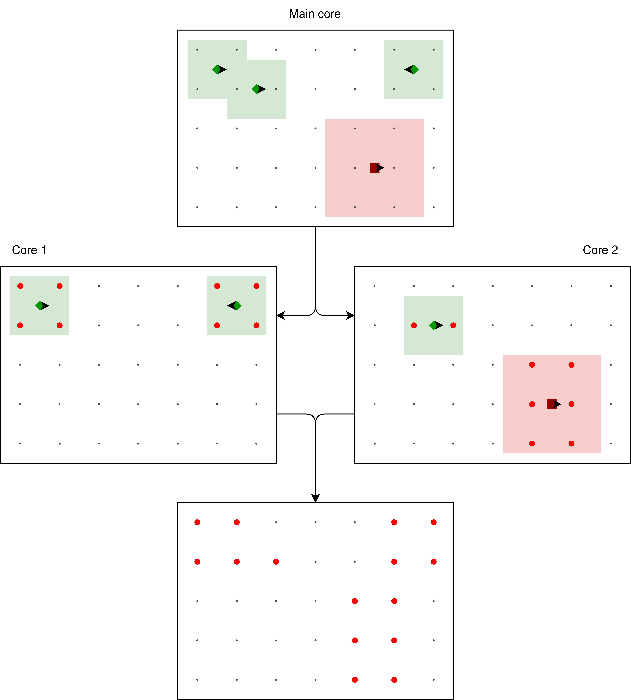

This document contains notions that shall not be part of the documentation but are very good topics for the presentation. It also contains some notes on what should be put inside the final documentation.

## Architecture

### Data processing module (Spark)

The fundamental step of back-end processing is associating each noise record with the nearest POI (Point Of Interest). It's a computationally expensive task and only on the back-end there is a map with the POIs; for this reason, the task is performed by the Spark cluster.

The process of associating each noise record with the nearest POI can be schematized as follows:

<p align="center">
  
</p>


The Spark cluster is composed of two main steps: map and reduce.

#### Map

We get as input a set of tuples in the form `<position, noise value>`.
It roughly correspond to the "Data cleaning and enrichment" section of the specification. We:
* clean the data (discarding invalid data, i.e. below zero)
* associate each measurement with its nearest POI, using the position.

We so transform data in the form `<POI, noise value>`. The POI is the reduction key.

#### Reduce

It roughly corresponds to the "Data analysis" section of the specification. Spark handles the shuffling: assuming we are acting on the set of measurement for a single POI, we:
* Compute the relevant averages (hourly, daily, and weekly)
* Compute the streak duration
* Keep the top 10

These tasks can be performed using [Spark structured streaming](https://spark.apache.org/docs/latest/structured-streaming-programming-guide.html). Structured streaming seems to be more powerful than regular Spark straming.

Spark structured streaming naturally tags each event with a timestamp. Data coming from sensors can be nicely decorated with *event time* (time attached to the source). In this way, we can access the timestamp of the noise level mesurement, and this time is preserved in case of congestion: if the measurement is delivered late, the timestamp will still be correctly recognized and processed. However, **it is still open** (effectively as a TODO) how can we exploit this with the simulation data (since there isn't a straightforward correspondance with "clock time").

### Simulation module (MPI)

The simulated environment looks as follows:

<p align="center">
  
</p>

Every dot of the grid is a sensor, in some cases located in the "noise range" of one or more entities (humans or vehicles). The position of every entity and the noise detected by every sensor are recomputed every given time step.

For simplicity
* The "noise range" is a squared surface.
* Every entity is in straight motion towards a cardinal point, with a predefined probability of changing direction at every time step.
* If an entity reaches the region's border, it inverts its direction.

The steps of the simulation are
1. The set of entities is shared among all the cores. Each core processes a subset of the total amount of entities.
2. Every core computes which are the sensors covered by the noise range of each entity of its competence.
3. Every core builds a 2D map of the sensors, associating to each one the value of detected noise.
4. The maps are reduced to a single map using the sum operator. The result is a map with the total amount of noise detected by every sensor.

The following picture schematizes the process:

<p align="center">
  
</p>

The last important thing is that the data produced by the simulation is of the **exact** same format as the data produced by the Contiki module. This has two main advantages:
1. The Spark module doesn't need to handle differently the simulations and the real world
2. If the simulation is outsourced, the Spark module can use all its computational power to handle and process the incoming data
3. The simulation can be performed on a stand-alone module with specialized hardware for MPI

#### Usage

In the `MPI_simulator` directory, the module can be compiled with `make` (a Makefile is provided).

##### Command line parameters

The simulation parameters are provided via command line.
**NOTE**: For now, the program accepts integer and float arguments, and arguments are required.

The program accepts the following command line options:


| Short options | Meaning                          | Type    | Example  |
|---------------|----------------------------------|---------|----------|
| `P`           | Number of people                 | `int`   | `-P 100` |
| `V`           | Number of vehicles               | `int`   | `-V 10`  |
| `W`           | Width of the region (in meters)  | `int`   | `-W 500` |
| `L`           | Length of the region (in meters) | `int`   | `-L 300` |
| `t`           | Time step (in seconds)           | `float` | `-t 1`   |


| Long options       | Meaning                                                      | Type    | Example                     |
|--------------------|--------------------------------------------------------------|---------|-----------------------------|
| `Np`               | Noise produced by every person (in dB)                       | `float` | `--Np 2`                    |
| `Nv`               | Noise produced by every vehicle (in dB)                      | `float` | `--Nv 10`                   |
| `Dp`               | Radius of circular area affected by a person                 | `float` | `--Dp 2`                    |
| `Dv`               | Radius of circular area affected by a vehicle                | `float` | `--Dv 10`                   |
| `Vp`               | Speed of a person (in m/s)                                   | `float` | `--Vp 1`                    |
| `Vv`               | Speed of a vehicle (in m/s)                                  | `float` | `--Vv 14`                   |
| `db`               | Activate debug prints                                        |         | `--db`                      |
| `origin-latitude`  | Latitude coordinate (in decimal degrees) of the area origin  | `float` | `--origin-latitude 45.890`  |
| `origin-longitude` | Longitude coordinate (in decimal degrees) of the area origin | `float` | `--origin-longitude 9.0804` |

To print all the debug prints, the `db` option must be given first.

The following long option aliases are also supported:

| Long alias          | Short option |
|---------------------|--------------|
| `n-of-people`       | `P`          |
| `n-of-vehicles`     | `V`          |
| `width-of-region`   | `W`          |
| `length-of-region`  | `L`          |
| `noise-per-person`  | `Np`         |
| `moise-per-vehicle` | `Nv`         |
| `radius-of-person`  | `Dp`         |
| `radius-of-vehicle` | `Dv`         |
| `speed-of-person`   | `Vp`         |
| `speed-of-vehicle`  | `Vv`         |
| `debug`             | `db`         |

The "radius" of a person vehicle is intended as half the side of a square area. For instance, in the picture:

```text
          ---------
      ---/         \---
     /                 \
   -/                   \-
  /                       \
  |                       |
 /                   r     \
 |            P-------------|
 \                         /
  |                       |
  \                       /
   -\                   /-
     \                 /
      ---\         /---
          ---------
```

The `P` represents a person, and the radius is `r` (calculated as euclidean distance).

##### Convenience scripts

Three scripts are provided to quickly run the program:
  * `quickrun.sh` executes the simulation "clean", multithreaded
  * `debug.sh` executes the simulation multithreaded, with the debug flag
  * `single-thread` executes the simulation as a normal program, single-threaded and with the debug flag
