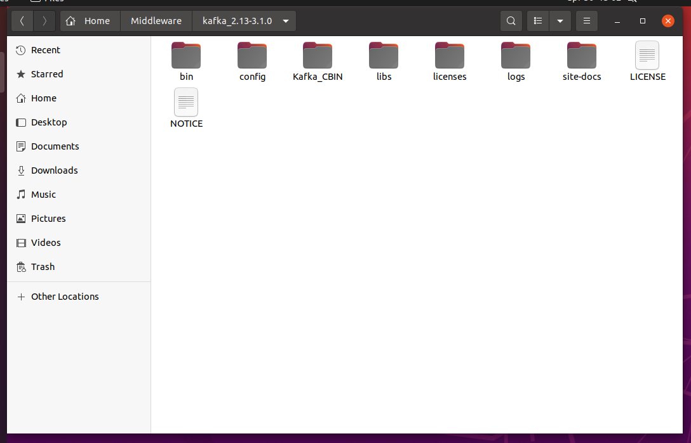

# Kafka

**NOTE: A working JVM (at least Java 11) is required to run the packages.**

The folder `Kafka_CBIN` contains the .jar file and some useful scripts to run the environment with the correct parameters. In order to work, it must be placed in the root folder of the Kafka installation (download [here](https://archive.apache.org/dist/kafka/3.1.0/kafka_2.13-3.1.0.tgz)).

  

* `1-run_zookeeper.sh` is necessary for Kafka to work.
* `2-run_kafka.sh` initializes the Kafka environment.
* `3-create_topics.sh` initializes the topics used in the application.
* `4-submit_application.sh` submits the .jar file in the app folder to the Kafka engine.

 

* `D1-run_publisher.sh` is useful for debugging, allows manual publication of events on a specific topic.  
Usage `./D1-run_publisher.sh topic_name`
* `D2-run_subscriber.sh` is useful for debugging, reads the content of a Kafka topic.  
Usage `./D2-run_subscriber.sh topic_name`

 

* `X1-clear_environment.sh` clears the system after the application is closed. Stop Kafka and Zookeeper before running this.
