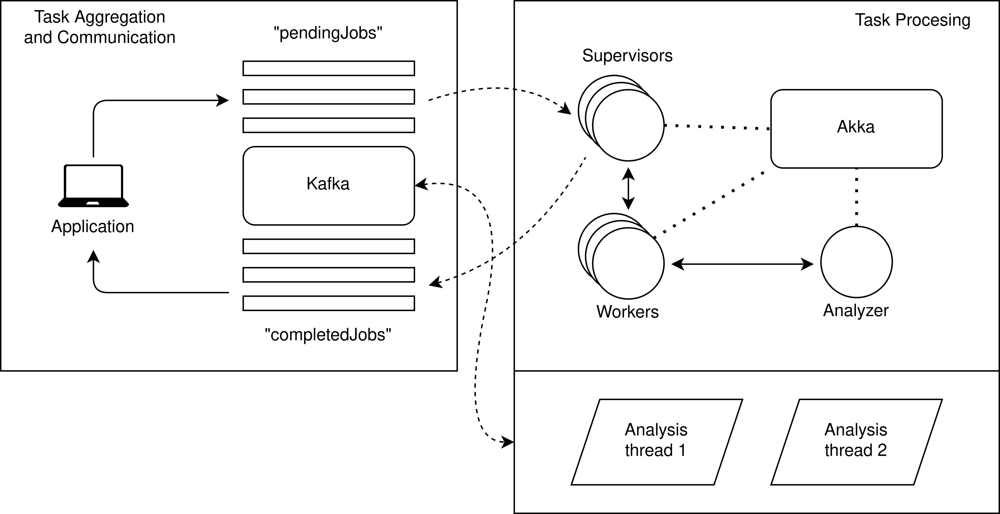
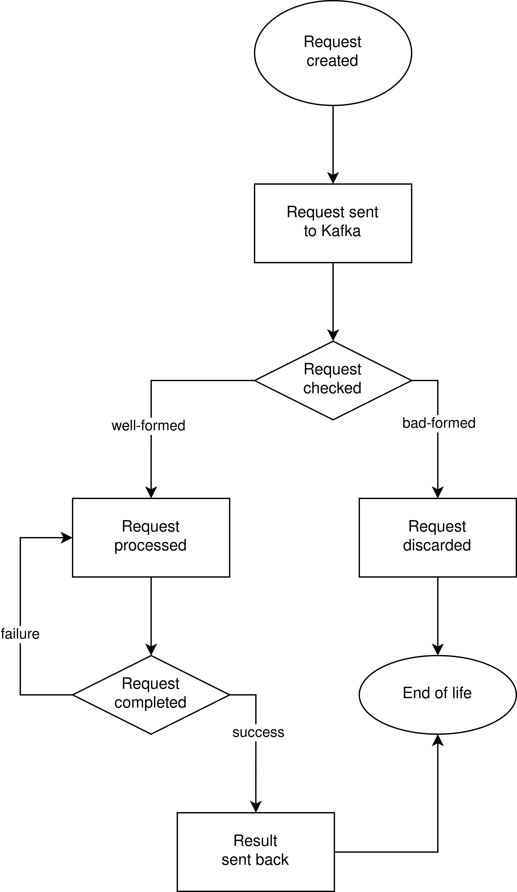

# Compute Infrastructure

<!--
This file shall be exported from Visual Studio Code using yzane.markdown-pdf extension.
The syntax to insert a page break in the printed file is 

-->

## Introduction

This project aims to design and implement a system that accepts compute tasks from clients and executes them on a pool of processes. Each request from a client includes the name of the task to be executed (e.g. image compression), a payload with the parameters to be used in the computation (e.g. a set of images and a compression ratio), and the name of a directory where to store results.

## Architecture

The distributed system is split into two modules:

* A **task aggregation and communication module** based on Apache Kafka.

* A **task execution module** based on Akka.

&nbsp;

  

&nbsp;

The communication between modules is performed through the network (local or the Internet).

The system is designed to be non-blocking for the final user. The use of logs between the front-end and the back-end allows the user to request the execution of a task and keep using the front-end application while it is being performed.

### Task aggregation and communication module (Kafka)

This module consists of a Kafka cluster with two topics:

* `pendingJobs` acts as a queue storing task execution requests from the users.

* `completedJobs` is a list of result folders where users can find the outcome of their requests.

Users can access Kafka topics through the front-end application, which serializes their requests to be correctly handled by the back-end module. This same application monitors the completed tasks to notify the user when its request is fulfilled.

When a new request by a user is generated, it is associated with a key that identifies that specific task. When an event with that key is published on the list of completed tasks, the application can locate it for the user and show a notification.

The set of submitted jobs is not persisted on the user's machine, but if they want to retrieve a previously submitted job (for example, after restarting the application), they can do so by resubscribing with the job key.

### Task execution module (Akka)

This module consists of an Akka cluster with a predefined number of simultaneous working blocks, together with some ancillary threads that compute metrics on the tasks performed. By "working block" we mean a pair of actors (a supervisor and a worker) that process a single task at a time.

* The supervisor actor interfaces with Kafka, acting as a consumer for the topic `pendingJobs`. Once it polls an event it checks if the payload is well-formed and possibly forwards it to its worker. When the worker finishes the task the supervisor gets notified and publishes a completion event on the topic `completedJobs`.

* The worker mimics the execution of the received task and notifies his supervisor once it finishes the computation.

Supervisors and workers are two distinct entities because the latter could fail and need to be restarted. Without a supervisor, it'd be more difficult to synchronize processed and unprocessed Kafka records. When a worker crashes, it stashes the currently worked job, so that it can be reprised when the worker restarts. Unprocessed messages, on the other hand, are persisted by the Akka framework. Each supervisor restarts its worker using `OneForOneStrategy`.

**Analysis**

The Akka application also uses additional threads for analysis purposes. Two classic threads act as consumers for the Kafka topics, retrieving their input data from the log. The third element is a stand-alone actor, that gets notified whenever a job is completed. Each working block, when a job fails, keeps a record of how many times the job is started before being completed. This information is passed to the analysis actor, that can then compute the average for each job.

## Design choices

### Kafka for task aggregation and communication

The main factor that led to this choice is the storage capability of Kafka which makes it perfect for the implementation of a queue. In addition, the use of Kafka allowed automatic load balancing through the feature of consumer groups and made the whole system intrinsically asynchronous. Moreover, Kafka has a very powerful horizontal scalability so when the system grows in size it's enough to distribute the Kafka cluster and replicate the nodes to hold the load.

### Akka for task execution

Since the specification requires scheduling the task execution onto a set of processes, the choice of Akka was the most fitting. The actor paradigm of Akka is symmetric with the need to mimic multiple available processes for task execution. This choice also allowed the implementation of the strategies for failure-handling since Akka provides the needed primitives for this purpose, which aptly fitted our requirements.

**Why not Spark?**

Even if Spark is very powerful when it comes to task execution, the scenario for this application didn't fit the Spark typical use-case. Spark is very good at processing pre-deployed operations on a huge amount of data, while in this application the amount of data isn't a problem since the information exchanged between the user and the back-end are only task execution requests. Moreover, when a failure occurs in Spark, it is necessary to reboot the whole system. In the actual scenario of this application, failures may affect only a partition of the system.

## Main functionalities

The main functionalities of the application can be recalled with the following commands:

* `submit <input_path> <parameter> <output_path>` creates a new task execution request.

* `retrieve <job_key>` adds the job key to the set of monitored ones.

It is meaningful, for this application, to show the flowchart of the life of each user request. The overall picture of the system is given by the union of many requests processed simultaneously.

&nbsp;

  

&nbsp;

## Conclusions

The intrinsic modularity of the systems allows deployment without bothering with the links between modules (except for the location of the Kafka bootstrap servers). Each module can be run separately from the others since the system is fully asynchronous. Each module was independently tested with corner cases and in a maximum-stress environment.

**Authors:** Simone Braga, Alessandro Bertulli, Marco Dottor
